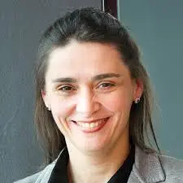
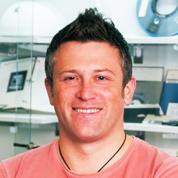

In the FME Teaching Committee, we coordinate a tutorial series, planned to be held monthly. We aim to increase the awareness and sharing of tools and techniques used for teaching formal methods. The series is held online via zoom. We record (whenever the speaker agrees) these presentations and collect them below.

{}
If you wish to receive announcements on these lectures, please subscribe to our mailing list fmtea@fmeurope.org by sending an email to sympa@lists.uu.se with the subject line  
**SUBSCRIBE IT-FMEUROPE-FMTEA firstname lastname**
{}

{}
## Zoom coordinates
Here are the details of the scheduled Zoom meeting:

- Topic: FMTea Tutorial Series
- Time: This is a recurring meeting Meet anytime

- Join Zoom Meeting: https://aboakademi.zoom.us/j/64254430116

- Meeting ID: 642 5443 0116

- Join by SIP
-- 64254430116@109.105.112.236 or 64254430116@109.105.112.235

- Join by H.323
-- 109.105.112.236 or 109.105.112.235
{}

<!---# List of Tutorials--->


## 2025

<!------------------------------------------------------------------------------------>
-  November 28, 2025, *10am CET*: [Graeme Smith](https://staff.itee.uq.edu.au/smith/), [University of Queensland](https://www.uq.edu.au/), Australia: **Autograding weakest precondition proofs and Dafny specifications**

- The recording of Prof. Smith's lecture can be seen [here](https://panopto.abo.fi/Panopto/Pages/Viewer.aspx?id=bddba293-9988-4907-b1d1-b3a300ac503f) and a few snapshots from the lecture [here](https://www.dropbox.com/scl/fo/rnaguctg9zawp33d20nky/AA-zt-R5Y-shErtv3BtDdNc?rlkey=2xn9fjpn2s13i57azdnzzq3vj&dl=0). 

- 

Autograding has been widely used in programming courses for decades. It reduces the marking load on teaching staff, providing them with more time to give higher quality feedback. There is little work, however, on autograding in formal methods courses where the emphasis is not on programming, but on writing proofs and specifications. This presentation describes a tool which employs the proof capabilities of Dafny to automatically grade students’ weakest precondition proofs and Dafny method specifications. The tool has been designed to (i) be reusable for new versions of assignments, with minimal input from teaching staff, (ii) allow fine-grained marking, in order to give students part marks for partially correct solutions, and (iii) not artificially constrain students' use of programming techniques where they need to provide code as well as specifications, allowing them to apply best programming practices.



- 

Dafny has been, for a while now, one of the most prominent verifiable programming languages taught worldwide. Only in [our database](https://fme-teaching.github.io/courses/) we have 17 courses that use it at the moment, including Prof Smith's course named **Reasoning about Programs**. Classical autograding for programming courses is typically based on writing tests and then scripts, that will be running students' code against the tests. This does not work well for the output we ask from students learning Dafny, as they need to return weakest precondition proofs and write specifications that include pre- and postconditions, termination metrics, loop invariants, and more. Writing code is still a part of the assignments, but it is not the most important part. 

In this tutorial, Prof Smith describes the solution they recently developed and tested at University of Queensland in Australia. They developed an autograder that employs Dafny's own proof engines in an ingenious manner. The tutorial details their approach for the three assignments in the course. Essentially, all the ghost entities used by students for specifications are collceted and then verified to be equivallent to the offcial solutions using Dafny's *calc* statement. This does not restrict the students's programming techniques and allows for partial grading of the solutions. 

Graeme's course has grown over time from 73 students in 2018 to 217 in 2025 and an estimated 300 for the 2026 version to be held during spring 2026. Clearly, some form of autograding is needed, even when teaching assistants are available. The autograder provides a good checkpoint for the teachers too and could be extended to provide tutoring to students as well.


  
---

<!------------------------------------------------------------------------------------>
-  September 26, 2025, 3 pm CEST: [Gustavo Carvalho](https://ghpc.github.io/), [Universidade Federal de Pernambuco](https://www.ufpe.br/inicio), Brazil: **From specifications to code with B: a personal account on teaching formal methods in Brazil**

- The recording of Dr. Carvalho's lecture can be seen [here](https://panopto.abo.fi/Panopto/Pages/Viewer.aspx?id=201439dd-a1bf-4533-bee6-b36400ed9601) and a few snapshots from the lecture [here](https://www.dropbox.com/scl/fo/2qn9mf7yvvtoz94wmo9kg/AJWjdif3EUM8yHBw_R2FJWM?rlkey=evrq3gman6g00mp9d3iuuh4wy&dl=0). The slides of the presentation are also available, [here](https://www.dropbox.com/scl/fi/i4g9g0skcl0rqfcclkirm/fme_teaching_Gustavo_Carvalho_2025-09-26.pdf?rlkey=dx93gkuh9mmjqyg2xkrmhkk7b&dl=0).

-  

In his tutorial, Dr. Carvalho presents his perspective on teaching Formal Methods as a rigorous reinterpretation of Software Engineering, moving stepwise from abstract specifications all the way to actual implementations. This approach - based on his more-than-a-decade-long experience with the topic - is backed by a recent [paper](https://dl.acm.org/doi/10.1145/3702231) surveying the role of Formal Methods in Computer Science (CS) education and claiming that 

>... every computer scientist needs to know Formal Methods..., since the skills and knowledge acquired ... provide the indispensable solid foundation that forms the backbone of CS practice

To that end, Gustavo takes the students from specifications to automatic code generation, with intermediate correctness proofs, animation techniques and visualisation methods. 

Initially, he taught a combination of Z and CSP# due to the local curriculum requirement on concurrency. Despite engaging the students with several software platforms (PAT for CSP# concurrent models verification, CZT for typing Z schemas/programs and Z-Eves for proving), the feedback pointed out the weakness of Z-related tools, in addition to the loose connection between the two formalisms. Building on this initial phase, Gustavo continued with teaching a combination of Event-B and CSPM, attracting positive feedback on the Event-B related software tools, such as Rodin, ProB and B Motion Studio. The last and current phase consists in teaching only B, due to several developments: the possibility to drop the mandatory concurrency requirement and the recent availability of a B Massive Open Online Course (MOOC). The latter development allowed for changing from a classical teaching format to a flipped classroom, where students are required to follow the MOOC course and then implement in a laboratory the various exercises and projects, with teacher support. The feedback from students changed to an appreciation of the employed software tools (Atelier-B, ProB, B Motion Web and VS Code) together with the integrated nature of the course, since some of the projects involve code generation in C with embedding in various platforms of interest for students.

[The volume of the presented courses ranges to about 25 students, which is rather impressive, considering the volume of the particular student intakes (50 students starting every semester), the advanced nature of the modules hosting the courses, as well as the optional quality of the course in the most recent curriculum.]: #

A constant observation students provided - throughout the three phases - is the scarcity of the community working in all these formalisms. Thus, in contrast with - for instance - programming languages, where one can find a remarkable body of resources, for B and related topics the existing materials and community are not very large. Coming back to the motivation cited by Gustavo, it seems that making such a course mandatory for all students would be a very important factor. We maybe simply need to reorganise and make available widely the numerous examples of advantageous use of Formal Methods.



---

<!------------------------------------------------------------------------------------>
-  August 1, 2025, 3 pm CEST: [Dragana Milovancevic](https://people.epfl.ch/dragana.milovancevic/?lang=en), [EPFL](https://lara.epfl.ch/w/), Switzerland: **Formal Autograding in a Classroom**

- The recording of Dr. Milovancevic's lecture can be seen [here](https://panopto.abo.fi/Panopto/Pages/Viewer.aspx?id=f01346f3-2feb-4724-a7e1-b32f00b8cdae) and a few snapshots from the lecture [here](https://www.dropbox.com/scl/fo/c77tleoxz45pw2rbkr5nv/AIbQAzXM5zJUFYXHVDBzN6M?rlkey=9margd81nrq89sic6bzna6aq7&dl=0).

- 
  
In this talk, I will present our work on automated grading of functional programming assignments, and share our experience in enhancing automated grading in an undergraduate programming course using formal verification. In our experiment, we deploy a program verifier to check the equivalence between student submissions and reference solutions, alongside the existing, testing-based grading infrastructure. Consequently, we achieve higher confidence in correctness of idiomatic solutions but also more thorough assessment of solution landscape that reveals solutions beyond those envisioned by instructors.



-  

The talk focuses on autograding programming assignments in the context of a large (about 400 students) second year undergraduate *Software Construction* course held at EPFL. Given the size of many courses nowadays, some automation for assignement verification needs to be used; unit testing is one candidate for verifying programming assignments. However, this sometimes proves inaccurate when some cases are missed out, in addition to the problem of ignoring the source code provided by the student and only considering the input/output relations. The latter issue leads to impersonal feedback that the student cannot learn much from. The solution discussed in this tutorial proposes to use formal methods (in particular program equivalence) in addition to unit testing, for verifying programming assignments written in a subset of the SCALA functional programming language.

Dr. Milovancevic and her colleagues implemented this solution in the context of a local automated grading system called *Stainless*, that is used in several courses at EPFL and works in principle based on pre- and post-conditions. However, this requires that some level of specification skills are needed. Instead, the solution discussed in the talk needs no such knowledge, only the source code the student provides: it then works as a push button approach. This is a remarkable usability improvement.

The proposed solution returns a congratulatory message if the student's code is proved equivalent to the reference solution. It can also provide a counterexample when a wrong input is found as proof of the solution being incorrect. The student receives such feedback within minutes and can resubmit their code. Interestingly, when all solutions are in, the autograder generates for the teacher a set of clusters: one for the reference solution and all solutions equivalent to it, and as many other clusters as found for all the other solutions that are submitted. Some other correct solutions can be found, or incorrect solutions can be seen as equivalent to other incorrect solutions.

This is the beauty of this proposal: code can be written in many ways that can be deemed acceptable and be verifiable. Even more, if many solutions have the same type of error, the teacher can address them systematically in the following lecture or even warn students against them the following year.

This proposal was integrated in the *Software Construction* course as an experiment for two years already. Thus, we have the tools to check for the diversity and creativity of programming solutions; we can also argue that much more innovation can be drawn from the lessons learnt, for instance to check for students providing identical solutions.



---

<!------------------------------------------------------------------------------------>
-  June 06, 2025, 3 pm CEST: [Prof Philip Wadler](https://homepages.inf.ed.ac.uk/wadler/), [University of Edinburgh](https://www.ed.ac.uk/), UK: **Lambda, the Ultimate Teaching Assistant (Agda version)**

- The recording of Prof. Wadler's lecture can be seen [here](https://panopto.abo.fi/Panopto/Pages/Viewer.aspx?id=7244668e-78e8-4790-895a-b2fb00a38d84) and a few snapshots from the lecture [here](https://www.dropbox.com/scl/fo/xufprm28ohj168ahrqlix/AMIi1M-94AABFTO4dumLvsY?rlkey=c1wrxply909ucmqx4x5p7fdbw&dl=0).

-  

*Proof assistants*, such as Agda, Coq, HOL, Isabelle, Lean, or Twelf, permit formal
statements of propositions and proofs in a way that can be checked by a
computer.  Some assistants, such as Coq, also provide a way to write *tactics*
to describe how to search for a proof.  The use of mathematics to describe
programs and programming languages, known as *formal methods*, can benefit from
a proof assistant.  In particular, use of a proof assistant in teaching provides
immediate feedback to students.

One of the leading textbooks for formal methods is Software Foundations (SF),
written by Benjamin Pierce in collaboration with others, and based on the proof
assistant Coq. After five years using SF in the classroom, I have come to the
conclusion that Coq is not the best vehicle for this purpose, as too much of the
course needs to focus on learning tactics, to the cost of learning programming
language theory. Accordingly, I have written a textbook, Programming
Language Foundations in Agda (PLFA), based on the proof assistant Agda. PLFA
covers much of the same ground as SF, although it is not a slavish imitation.

What did I learn from writing PLFA? First, that it is possible. One might expect
that without tactics proofs become too long, but in fact proofs in PLFA are
about the same length as those in SF. Proofs in Coq require an interactive
environment to be understood, while proofs in Agda can be read on the
page. Second, I compared two standard methods of formalising programming, one
with extrinsically-typed terms and one with inherently-typed terms. SF uses the
former presentation, while PLFA presents both; the former uses about 1.6 as many
lines of Agda code as the latter, roughly the golden ratio. Third, that
constructive proofs of preservation and progress give immediate rise to a
prototype evaluator. This fact is obvious in retrospect but it is not exploited
in SF (which instead provides a separate normalise tactic) nor can I find it in
the literature. Fourth, that if the final exam is administered online with a proof
assistant, students can achieve perfection. 

**The textbook is written as a literate Agda script, and can be found here:**

 http://plfa.inf.ed.ac.uk



-  

The work that Prof. Wadler discusses is set up in the context of proof assistants having the potential of acting as TAs for students. For that role, Phil created an alternative to the well-established book Software Foundations that uses the theorem prover Rocq (formerly known as Coq). Phil’s alternative spares the students having to learn Rocq features that are perhaps too complicated for novices (tactics, for instance). Phil’s approach uses Agda, a dependently typed, functional programming language and a proof assistant, and is aimed at teaching programming language foundations for advanced students in their fourth year. 

The implicit prerequisite for such a course is a first-year course in programming using Haskell. The size of the course is about 40 students. The lecturing goes on 2-3 times per week during the 11-week semester. Each lecture is organised with one hour of teaching and one hour of tutorial where students work on their computers, supervised by Phil and his TA. Students can collaborate with colleagues and can use Generative AI, as long as they are able to explain their code and proofs. Prof. Wadler's work is an excellent example of teaching Formal Methods based on reliable tools that students enjoy using - these tools create challenges not unlike in video games, thus motivating the students to dig deeper in order to prove correctly. Proofs in Agda are often simpler to understand and read than proofs in other theorem provers, hence, they are more appropriate for undergraduates or early graduate students. 

In the end of the talk, some discussion focused on the link between Generative AI, proving, and teaching Formal Methods. Phil remarked that Generative AI tools should be used and trained to help us, and that we would still be needed as Formal Methods educators, to teach for instance when to ask these tools to take over and fill in parts of the proofs. The tutorial ended by suggesting that "hallucination" is not the proper term to use for describing the Generative AI erroneous answers.



---

<!------------------------------------------------------------------------------------>
-  March 28, 2025, 4 pm CET: [Prof Peter-Michael Osera](https://osera.cs.grinnell.edu/), [Grinnell College](https://www.grinnell.edu/), US: **Formal Verification and Foundations: Better Together!**

  - The recording of Prof. Osera's lecture can be seen [here](https://panopto.abo.fi/Panopto/Pages/Viewer.aspx?id=cd228eac-6666-4e60-a56d-b2ae01377ed0) and a few snapshots from the lecture [here](https://www.dropbox.com/scl/fo/x6uqvabouofrw1z534fhb/AB8h0YqQ5yM-KByabizKENc?rlkey=tylgs3n4qgr6mprxmfg80de3s&dl=0). 

  -  
During the tutorial, Prof. Osera described his vision on incorporating Formal Methods into the (already very full) Computer Science Curriculum in academia. One major issue seems to be the need to prove the relevance that formal verification and, more generally, discrete mathematics have for Computer Science future graduates. One simple idea is to promote discrete math via program verification, as long as the latter can be performed with a scalable tool providing feedback to the programmer; Peter-Michael cautions to carefully consider the formal proving tools that we might want to employ for teaching, as some are too complex to motivate students. Ultimately, all Computer Science graduates will need to know how to program well, which should include being able to reason whether their programs are correct or not. Discrete math or at least logic and set theory as subdomains of discrete math are the basic buiding blocks of such reasoning activities. A formalism provides the necessary vocabulary and level of detail for a proof of correctness, so that we do not skip steps in our reasoning. Proofs can also be less formal: prose-based proofs can be used for communication. More generally, we can construct programs with correctness as a guide and this should motivate anyone. Testing can also be seen as proving, which might help students adopt proof: a test case is just a proof that for some input, we will get a certain output.

Prof. Osera has recently won a a 3-year grant from NSF: [Integrating Formal Methods into the Foundational Undergraduate Curriculum](https://www.nsf.gov/awardsearch/showAward?AWD_ID=2422174). Under this grant, one of his objectives is to educate the educators in Formal Methods teaching, by organising verification-infused curricular design workshops as bootcamps for teachers, perhaps in the context of ACM's SIGCSE symposium. Peter-Michael is also currently writing a book, provisionally titled *Tools for Thought about Programming*.

<!--	&nbsp;&nbsp;&nbsp;&nbsp;Here is an abstract of the tutorial: How do we promote the importance and relevance of formal verification to undergraduate computer scientists? While we often focus on building better tools, we should spend an equal, if not greater, amount of time thinking about the pedagogy of formal verification. What are the essential theories and techniques every undergraduate should know from the field? In this talk, I introduce how I have addressed these questions, first through tool building and then through pedagogy. In particular, I present an ongoing multi- institutional project to integrate formal methods across the undergraduate curriculum, in particular, its mathematical foundations. 
-->

---
<!------------------------------------------------------------------------------------>

<!------------------------------------------------------------------------------------>
-  February 28, 2025, 3 pm CET: [Prof Marielle Stoelinga](https://people.utwente.nl/m.i.a.stoelinga), [University of Twente](https://www.utwente.nl/en/), The Netherlands: **Life long learning --- experience with educational programs for professionals**

  - [Here](https://www.dropbox.com/scl/fi/rcg3iid70o82nsd5kcjbn/2025-LLL-FM-education.pdf?rlkey=fydom8tdcbh0kk7b50x8ujisf&dl=0) you can see Mariëlle's slides for the lecture and [here](https://www.dropbox.com/scl/fo/0hdrhjqiqd5t57pd1652n/AD-WDN6zPsoZtMPJG5PcixU?rlkey=lh98z08vs1ok0wxr2lkn3dcwd&dl=0) a few snapshots from the tutorial.

  -  
During the tutorial, Mariëlle described her experience with teaching courses and leading education programs for life-long learning. Her employer - University of Twente - declared Life Long Learning (LLL) the fourth pillar of activity, in addition to initial education, research, and societal relevance, under the motto "We are not done learning when we are 25!"; Mariëlle is the director of Life Long Learning at the university, in addition to being a professor of Risk Management for Hightech Systems. The are numerous formats for LLL, among them creating tailored courses for specific companies, devising executive MSc programs and Engineering doctorates for professionals, or even supporting learning communities, where people with shared interests learn from and with each other.

Mariëlle's approach in teaching courses (in Risk Management and in Risk Models) consists in holding interactive workshops where mini- or midi-lectures are held, followed by groups of participants applying the concepts learnt into case studies of their choice. The courses typically contain also the presentation ("pitching") of these case studies by each participant group. The topics are general enough to be applicable in numerous fields; participants like that the difficulty level is not high (especially in Risk Management topics) and their usefullness is clear. Risk models are more complex than risk management topics, including even some formal aspects, such as probability theory; however, people are motivated by the fact that these models were developed in industry. Participants prefer to create risk models rather than analyzing them and find as very important the skill of choosing which model is important for a particular problem. 

This is a general finding of teaching for professionals: finding what motivates them and what they find useful in their particular field of activity. This task is for the teacher, since companies do not know - in general - what they want or need to learn. The infrastructure for organising these courses is also significant, involving workflows outside the teacher's field of expertise, such as signing contracts, setting up payments, even finding clients for LLL. The results from LLL are somewhat different than from regular university programs. The executive master programs award degrees as a completion of the studies, while tangible results from courses are certificates (with "University of Twente" on them) as well as so-called "microcredentials" or "edubatches" that are recognised as proof of compliance in various companies. A great outcome is that people in industry can be promoted based on such results. 

<!------------------------------------------------------------------------------------>

<!--
--
--
LIST OF 2024 TUTORIALS STARTS HERE
-->
---
---

## 2024
<!------------------------------------------------------------------------------------>
-  September 27, 2024, 3 pm CET: [Prof Rosemary Monahan](https://www.maynoothuniversity.ie/faculty-science-engineering/our-people/rosemary-monahan), [Maynooth University](https://www.maynoothuniversity.ie/), Ireland, on **Teaching Dafny at undergraduate and MSc level on Irish and Erasmus+ European Degree programmes**. 

  - The recording of Prof. Monahan's lecture can be seen [here](https://panopto.abo.fi/Panopto/Pages/Viewer.aspx?id=e47c68b5-f5b9-4498-b661-b1fa012337a6) and a few snapshots from the lecture [here](https://www.dropbox.com/scl/fo/6ksdjsvtkssua8y4p55t9/AL7T_07RANiR6rb4HZDvHpI?rlkey=ws80ondby0y22y7ep68oj83ah&dl=0). 

  -  
During the tutorial, Rosemary outlined her experiences in teaching Dafny first in a 3rd year course that this year has 185 students, then at the MSc level where there are 50 students, and then at the international Erasmus MSc level. In all these courses, practically the teaching takes place one day per week, where 3 hours of lectures are followed by 3  hours of lab work in applying the concepts learnt. What impresses visibly from this tutorial is not only the amount of students, but also Rosemary's involvement, dedication and perseverance, coding herself in front of and together with the students and receiving them after class in her office to untangle their proofs. While in the BSc course, she co-lectured with [Dr Hao Wu](https://classicwuhao.github.io/), and has the help of 12 PhD/4th year BSc students in the labs, in the MSc course she is alone handling the labs. Besides, there is a continuous assessment component as well as a written exam. The MSc continuous assessment is often inspired by software verification competitions such as VerifyThis, SVComp, and Toolympics. The teaching material includes Dafny, based on the recent [Program Proofs book](https://mitpress.mit.edu/9780262546232/program-proofs/) authored by Rustan Leino; but it also presents related concepts such as Hoare logic, theorem proving in Coq, temporal logic, model checking, SAT/SMT solvers, Event-B and Mu-FRET, the latter being a framework recently developed by Rosemary and colleagues for formalising requirements. Students are excited about the code generation aspects of Dafny and positive feedback has been given in the form of "Model checking popped up in my interview, I am so happy you taught us that!".

<!--	&nbsp;&nbsp;&nbsp;&nbsp;Here is an abstract of the tutorial: Prof. Monahan has taught Software Verification at undergraduate and postgraduate level for over 2 decades. 
In this talk, she presented her experience, overviewing what she teaches in modules on Software Verification (5 ECTS, delivered to 3rd year Bachelors students) and Rigorous Software Process (7.5ECTS, delivered to MSc students). In particular, she discussed the student's interaction with the Dafny Verifier in her courses, lab work and continuous assessment. 

	&nbsp;&nbsp;&nbsp;&nbsp;Rosemary also outlined her experience of directing an Erasmus+ MSc in Dependable Software Systems which she was successful in obtaining funding for from 2012 - 2018. An MSc on Advanced Software Systems Dependability was also funded under the Erasmus+ programme from 2018-2021 with the same consortium of universities.
-->

---
<!------------------------------------------------------------------------------------>

<!------------------------------------------------------------------------------------>
-   May 24, 2024, 3 pm CEST: [Prof Tiziana Margaria](https://www.ul.ie/hri/person/hri-member/prof-tiziana-margaria), University of Limerick, Ireland: **Teaching Formal Methods in Germany vs. Ireland: experience from two very different systems**. 
  
  - The recording of Prof Margaria's lecture is [here](https://panopto.abo.fi/Panopto/Pages/Viewer.aspx?id=d355113a-e8ae-4826-ba20-b17a00f14c3e). A few screenshots from the lecture can be seen [here](https://www.dropbox.com/scl/fo/paep2ehur7xe9v76gmibf/ACclqGozsCUSdw0zlnaRRlo?rlkey=948qemmivjk7xfkd4ybwej8ag&dl=0). 

  -  
Prof Margaria has significant experience in teaching Formal Methods to software engineering students  as well as to people with no software development experience. Her courses always revolve around case studies stemming from research, often in cooperation with industry, thus offering strong motivation to those studying. In a recently started project involving both academia and industry, they are going to develop so-called Formal Methods micromodules for the partners in industry, so that they come up to speed with the needed formalisms and tools. In fact, she argues for how to break the vicious circle of industry missing Formal Methods specialists educated by academia, while universities usually do not teach Formal Methods because the common knowledge is that industry manages without it: Tiziana suggests that we can start with teaching Formal Methods modules to industry, starting with FM-infused Model Driven Development as a flavour of the trendy Low-code/No-code movement. In this way, industrialists can experience some Formal Methods strength and ask for more. 

In the tutorial, Prof Margaria describes teaching Formal Methods in two countries: Germany and Ireland, pointing out some differences between their systems and students. Below is a list of teaching contributions in these two countries that Tiziana led:
 - [a survey on her group's experience](https://link.springer.com/referenceworkentry/10.1007/978-3-030-10576-1_208)
 - [teaching Formal Methods in Germany](https://ceur-ws.org/Vol-1385/paper4.pdf)
 - [a book on teaching Foundations of process modelling to non-CS students in Germany](https://link.springer.com/book/10.1007/978-3-662-45006-2)
 - [using models as a high level tool for computational thinking](https://ieeexplore.ieee.org/abstract/document/8377800) and another [here](https://ieeexplore.ieee.org/abstract/document/7273708)
 - [modelling for teenagers](https://ieeexplore.ieee.org/abstract/document/5090525), also [here](https://ieeexplore.ieee.org/abstract/document/7552218)


---
<!------------------------------------------------------------------------------------>

<!------------------------------------------------------------------------------------>
-   March 28, 2024, 3pm CET: [Prof Wolfram Kahl](https://www.cas.mcmaster.ca/~kahl/), McMaster University, Canada: **Teaching with CalcCheck**. 
  
  - The recording of Prof Kahl's lecture is [here](https://panopto.abo.fi/Panopto/Pages/Viewer.aspx?id=26acc5a4-a819-4927-a765-b1430177586b). A few screenshots from the lecture can be seen [here](https://www.dropbox.com/scl/fo/5nvk2ostzl3i2yu62no0n/h?rlkey=cy7ktcch7u2qujcfkmmdwff07&dl=0). 

  -  
Prof Kahl talked about his experiences in teaching with an impressive tool called CalcCheck: a proof checker for teaching Logics and Discrete Mathematics to second-year computer science students since 2010. CalcCheck is based on "A Logical Approach to Discrete Math", a classical logic book by Gries and Schneider. CalcCheck is web-based, with an interface similar to that of Jupyter notebooks that students are already used to. Before using CalcCheck, students used to ask "how do we know if our proofs are correct?". Now they get feedback on their syntax and proofs, side-by-side with their input. CalcCheck is also used in exams and has an auto-grader component that is of big help to the teachers, both in exams and midterms, but also for homework. Since CalcCheck is such a convenient tool both for teachers and students, since 2018 it was used for twice-a-week homework, a component that was a game changer for student understanding and higher grade distribution. CalcCheck is a tool dedicated to teaching, a proof checker rather than a proof assistant, and it implements the so-called "people logic" (of the textbook by Gries and Schneider) rather than mechanised logic, making it much more student-friendly. Prof. Kahl is the developer and maintainer of CalcCheck. Some features of CalcCheck:
 * Proof Checking: The ability to check the logical validity of each step in a mathematical proof. 
 * Interactive Exercises: Students can engage with interactive exercises that are designed to reinforce mathematical concepts and proof techniques.
 * Self-Learning: It can be used for self-learners of mathematical logic, discrete mathematics, and other related fields.
 * Customisability: Teachers can create custom exercises and problem sets tailored to their curriculum, making it a versatile tool for a variety of mathematical topics.

---
<!------------------------------------------------------------------------------------>

<!------------------------------------------------------------------------------------>
-  March 1, 2024, 10 am CET: [Prof Carroll Morgan](https://www.unsw.edu.au/staff/carroll-morgan), University of New South Wales, Australia: **Teaching formal methods informally: a report from the front line**. 

  - The recording of Prof. Morgan's lecture is [here](https://panopto.abo.fi/Panopto/Pages/Viewer.aspx?id=1688654f-9933-4053-83bd-b12600b7e091). A few screenshots from the lecture can be seen [here](https://www.dropbox.com/scl/fo/1tdkqqwz6tqcbvpb9qvk5/h?rlkey=zg5ggtkb41ja1994jgjvftdm7&dl=0). 

  -  
The lecture was about Carroll’s teaching of a course where informal reasoning about programs is promoted. The roots of this talk can be found in Prof Morgan’s invited lecture at the FMTea'19 symposium in Porto: check that lecture’s abstract [here](https://www.easychair.org/smart-program/FMTea19/2019-10-07.html#talk:133587). He argued there for incorporating Formal Methods thinking into the actual programming courses we teach, simply renaming the whole approach "Introductory Programming". The lecture was truly inspirational and Carroll continued teaching in this way at UNSW.

However, just after 2019's lecture his course had to change suddenly to being wholly on-line, and it significantly increased in size. In the current talk, Prof. Morgan discusses how he handled the new challenges that introduced, and what might lie ahead. One interesting aspect of the course now is a single whole-term programming assignment, incrementally developed by students every successive week. That makes the students always feel up-to-date with the course material: a very important aspect for their self-confidence and continuing engagement in the course topics. Each weekly assignment portion comes with an auto-marked quiz: students get the questions on Tuesday, but not the multiple options (needed for automatic grading) for each question’s answer until Friday; and then they have time to reply to the questions until the following Monday. The few days spent just with the questions allow students time to think and formulate possible answers without knowing yet what choices will be available.

Prof. Morgan also argues that the target “audience” we need to address in the Formal Methods courses is neither the top nor the bottom minorities, who will do what they usually do more or less independently of how we teach them. Instead, we need to focus on the middle majority --- because they are the people who will program our phones in 10 years. If we can make an impression on them, with respect to incorporating the ideas of Formal Methods reasoning into their everyday programming tasks, then we have fulfilled our mission.

---
<!------------------------------------------------------------------------------------>

<!------------------------------------------------------------------------------------>
-  January 26, 2024, 3pm CET: [Prof Alcino Cunha](https://alcinocunha.github.io/), University of Minho ([Department of Informatics](https://www.di.uminho.pt/)), Portugal: **Teaching Alloy with Alloy4Fun**. 

  - The recording of Prof. Cunha's lecture is [here](https://panopto.abo.fi/Panopto/Pages/Viewer.aspx?id=64389960-29d9-4430-82c2-b106007baad8). A few screenshots from the lecture can be seen [here](https://www.dropbox.com/scl/fo/hqwmpzw0wxjnb1j9yqdd4/h?rlkey=gd8y78yaaio8ff7cd6jf6xtqx&dl=0). 

  -  
Alcino was one of the proponents of Alloy6 and Alloy4Fun, has been teaching with Alloy for more than 15 years, and uses Alloy4Fun in teaching since 2019. Some info on Alloy4Fun can be seen [here](https://haslab.github.io/Alloy4Fun/tutorial.html) and Alloy4Fun itself can be found [here](http://alloy4fun.inesctec.pt/). The main two goals for proposing Alloy4Fun were (i) the need to easily share models in Alloy with students and (ii) the need to get immediate feedback on the just written specifications. Neither of these were possible with the standard tool for modelling with Alloy (Alloy Analyzer). During the tutorial, Alcino gives a demo on how to write and check Alloy specifications in Alloy4Fun and explains how he uses this in the course **Formal Methods in Software Engineering** - a mandatory MSc course attended every year by more than 200 students.

<!------------------------------------------------------------------------------------>

<!--
--
--
LIST OF 2023 TUTORIALS STARTS HERE
-->
---
---
## 2023
<!------------------------------------------------------------------------------------>
-  June 16, 2023, 3 pm CEST: [Prof Laura Kovács](http://lkovacs.com), Vienna University of Technology ([TU Wien](https://www.tuwien.at/en/)), Austria: **Teaching Formal Reasoning at TU Wien**. 

  - The recording of Prof. Kovács' lecture can be seen [here](https://panopto.abo.fi/Panopto/Pages/Viewer.aspx?id=a9b23939-37cb-4db9-b492-b02b00453f07) and screenshots from the lecture can be seen [here](https://www.dropbox.com/sh/ocyt0ho7988gc8n/AABMOG6EqA9S_egjLrKtBszSa?dl=0). 

  -  
Laura talked about her experiences on teaching two courses at TU Wien: _Formal Methods for Computer Science_, a mandatory MSc course and _Automated Deduction_, an elective MSc course. While the latter course is attended by about 40-50 students, the former course is mandatory for MSc students and is taught twice per year: both times, it is attended by hundreds of students, which is both a wonder as well as a challenge. For instance, in a recent paper, Laura explains how to manage generating exam sheets in this context, with the awesome detail that the generation of these sheets uses Formal Methods! For more details, [here](https://link.springer.com/chapter/10.1007/978-3-030-81097-9_15) is the link to that 2021 paper. Among several interesting aspects related to the teaching materials, students learn how to generate loop-based programs given the invariants of loops, using tools developed in TU Wien, the research results for this topic being [published last year](https://dl.acm.org/doi/10.1145/3527458).

Some remarkable effects of Laura's teaching are the motivation and inspiration many students get, and driven so, they choose to write their MSc theses in Formal Methods, some of them even choosing to remain in academia in Laura's research group. This is really wonderful and rare: many of us let our research results to influence our teaching, but for teaching to influence research is less heard of. Driven by the success of these graduated courses, from next spring, TU Wien will also provide a Formal Methods course for BSc students, called _Logic and Reasoning_. The slides of Laura's presentation are [here](https://www.dropbox.com/s/wa37syjo8qbhhcm/FMTea23_Kovacs.pdf?dl=0).

---
<!------------------------------------------------------------------------------------>

<!------------------------------------------------------------------------------------>
-  May 26, 2023, 3 pm CEST: [Research Director Thierry Lecomte](https://www.researchgate.net/profile/Thierry-Lecomte-2), [ClearSy](https://www.clearsy.com/en/), France: **Teaching and Training in Formalisation with B**. 

  - The recording of Dr. Lecomte's lecture can be seen [here](https://panopto.abo.fi/Panopto/Pages/Viewer.aspx?id=75f2adc1-85dd-40a5-8209-b00f00566e03) and screenshots from the lecture can be seen [here](https://www.dropbox.com/sh/trnee19wpf38vis/AACAwdsK30SFNpI3ofvwgra2a?dl=0). 

  -  
Thierry talked about his experiences of almost 30 years spent in the education of engineers (colleagues or customers) and students, together with the parallel design and improvement of supporting modelling tools in B. In a [recently published paper](https://link.springer.com/chapter/10.1007/978-3-031-27534-0_6), Thierry says: _Applying formal methods in software industry is still perceived as a difficult task. To ease the task, providing tools that help during the development cycle is essential, but **proper education of computer scientists and software engineers is also an important challenge to take up!**_ Clearsy is an adept of Piaget's hypothesis that only one third of the population is able to handle abstraction, and so, people are sorted into their most suitable job based on how they perform in their initial training. People that are hired at Clearsy need to have some experience in modelling, independently of the modelling language. A big part of a Clearsy engineer's job consists in proving interactively various system properties, in average about 16 proofs per day. Training engineers is therefore focusing on all these aspects. The slides of the presentation are [here](https://www.dropbox.com/s/6apq9e97mxbn72p/formalisation%20with%20B.pdf?dl=0).

---
<!------------------------------------------------------------------------------------>

<!------------------------------------------------------------------------------------>
-  April 28, 3 pm CEST: [Associate Prof Stefan Hallerstede](https://pure.au.dk/portal/en/persons/stefan-hallerstede(65c96a3f-b4af-473c-a0d8-7909b2f2903c).html) (Aarhus University, Denmark): **A guide to Not teaching Formal Methods**. 

  - The recording of Prof. Hallerstede's lecture can be seen [here](https://panopto.abo.fi/Panopto/Pages/Viewer.aspx?id=2925e202-0e3f-442d-a677-aff201037070).  Screenshots from the lecture can be seen [here](https://www.dropbox.com/sh/gvpmkco20voslek/AABHIy9MeP-ivZj8vrltJqTca?dl=0). 

  -  
Stefan's talk was based on his experience in creating a new curriculum for Software Engineering studies at the undergraduate level, where they embedded Formal Methods somewhat inconspicuously in about 9 fundamental courses. A paper describing this process can be checked [here](https://doi.org/10.1007/978-3-030-57663-9_12). Creating a new BSc curriculum on Software Engineering in 2020 was a remarkable opportunity, given that in Århus University there is also a more theoretical program as well as a more applied program. Currently, the new Software Engineering program has about 50 students enrolled, but it can take up to 60 every year. The main idea of this program is to focus on what it means to be a good engineer in software: understand why a solution works or does not work, know the technologies, understand the importance of teams and communication - thus, not only programming. The focus is on programming methodology and not program constructs, because it is in the programming methodology that formal methods make sense. Three important features that the BSc program emphasises are (serious) thinking about the problem to solve, being rigorous, and understand program development in the sense of refinement. Teaching is dedicated to the students being young people, for instance containing numerous puzzles and challenges. Students and industrial partners already offer good feedback on this new initiative. The slides from the presentation can be seen [here](https://www.dropbox.com/s/kekyrv96hy48qpt/slides.pdf?dl=0).

---
<!------------------------------------------------------------------------------------>

<!------------------------------------------------------------------------------------>
-  March 31, 3 pm CEST: [Associate Prof Emil Sekerinski](http://www.cas.mcmaster.ca/~emil/) (McMaster University, Canada): **Teaching Concurrent Programming**. 

  - The recording of Prof. Sekerinski's lecture can be seen [here](https://panopto.abo.fi/Panopto/Pages/Viewer.aspx?id=ca358ec9-f380-422a-bfc8-afd601231cf7).  A few screenshots from the lecture can be seen [here](https://www.dropbox.com/sh/pfnexhierzr5v8i/AACgpCWmyug7sel-6DsPqeQSa?dl=0). 
   
  -  
Emil focuses his research on formal methods for more than three decades now and currently uses formal methods to teach concurrency at McMaster University in Canada. This is a mandatory course for students in their 3rd year of BSc studies and has about 150-200 participants every year. The method for teaching concurrency has been introduced earlier, in a [paper](https://link.springer.com/chapter/10.1007/978-3-030-32441-4_9) presented in 2019 at the FMTea workshop. Multiple languages are used to teach students in this course - python, java, C, Go - and some of these (most notably Go) are not familiar to students beforehand. Also, no separate formal methods course precedes this one in the curriculum, although students have already had some logic and discrete math courses. Notably, the course is taught based on Jupyter notebooks, where students can directly compile python code and indirectly (but rather easily) can compile programs written in the other three languages. These notebooks are also available for self-study.

The abstract of the talk follows below: 

>The education in programming has in a certain sense deteriorated since the 80’s and 90’s: programming languages and environments, as common in industry and to which students are exposed in Computer Science, Software Engineering, and related programs, have become complex. Mastering them consumes students to an extent that courses cannot decouple the (timeless) principles of programming from the (short-lived) specifics of the programming environments at hand; the mathematical background on program design is often not taught. This is particularly critical for concurrent programming, which has become increasingly relevant but cannot be mastered without a theoretical background. The author has been developing course material for a required 3rd year Software Engineering course at McMaster University, Concurrent System Design with around 170 students, since 2018 to address that issue by web-based interactive notebooks using Jupyter that combine explanations, the mathematical theory, and execution of programs directly in the notebooks. Correctness reasoning, including non-interference of processes, is explained through hierarchical state diagrams. This talk gives an overview of the course material, which is available as an open educational resource, and reports on the experience.


<!------------------------------------------------------------------------------------>

<!--
---
- *Postponed*  ~~*January 27, 2023, 3 pm CET: [Dr Oana Andrei](http://www.dcs.gla.ac.uk/~oandrei/) (University of Glasgow, UK): **Modelling and Verification for Reactive Systems**.*~~
-->

<!--
--
--
LIST OF 2022 TUTORIALS STARTS HERE
-->
---
---
## 2022
<!------------------------------------------------------------------------------------>
-  December 9, 2022, 3 pm CET: [Principal Research Engineer Markus A. Kuppe](https://www.linkedin.com/in/markus-kuppe-643559180/), (RiSE group at Microsoft Research, US): **Stories from the trenches: Teaching the TLA+ specification language in Industry**. 

  - The recording of Eng. Kuppe's lecture can be seen [here](https://panopto.abo.fi/Panopto/Pages/Viewer.aspx?id=1ea5f90b-889b-493d-be8b-af6700c64031). A few screenshots from the lecture can be seen [here](https://www.dropbox.com/sh/mzznc34i7z6mvl1/AAB0wrw9vGfRqVCNkm8NoLaEa?dl=0). 

  -  
Markus works with Formal Methods at Microsoft for about 8 years, focusing on scaling verification to real-world problems and building tools that embed specification with established software engineering processes. He also teaches occasionally TLA+ to industrialists and in this lecture he described his experiences. Markus started by pinpointing the main features of TLA+, such as the fact that we can write both programs and the properties about the programs in the same language, the TLC model checker (main verification workhorse, enabling the proving of safety, liveness and refinement), PlusCal (the pseudocode avatar of TLA+, somewhat preferred for its non-mathematical syntax, although features such as complex fairness and refinement cannot be captured), Apalache (the new kid on the block in terms of verification, based on Z3), and TLAPS (the proof system which encompasses all the above). Examples in TLA+ can be checked [here](https://github.com/tlaplus/examples). He described challenges for engineers, such as the fact the liveness and fairness are not concepts common in programming; he also observed how various characteristics do not pose a challenge to programmers, such as the TLA+ syntax (programmers are "polyglots") and the "always" and "eventually" operators. The TLA+ teaching materials that Markus uses in his workshops can be seen [here](https://github.com/tlaplus-workshops/ewd998).

---
<!------------------------------------------------------------------------------------>

<!------------------------------------------------------------------------------------
- *Postponed* ~~*(**Wednesday**!!) November 30, 2022, **10 am CET**: [Prof Carroll Morgan](https://www.unsw.edu.au/staff/carroll-morgan) (University of New South Wales, Australia): **Teaching formal methods informally: a report from the front line**.*~~
---
-->

<!------------------------------------------------------------------------------------>
-  October 28, 2022, 3 pm CEST: [Dr Allan Blanchard](https://allan-blanchard.fr) ([CEA-LIST](http://www-list.cea.fr/en/), France): **Formal methods for beginners and for C programs - Using Frama-C and its WP plug-in for teaching**. 
  
  - The recording of Dr. Blanchard's lecture can be seen [here](https://panopto.abo.fi/Panopto/Pages/Viewer.aspx?id=6e88214a-7d90-46ce-aed9-af3c00f2efbe). A few screenshots from the lecture can be seen [here](https://www.dropbox.com/sh/e9930tnjq16yqn7/AAB7acpEvzhXuqJsfmRcN0Mfa?dl=0). 

  -  
[Frama-C](https://frama-c.com) is a set of (mostly open-source) tools aimed at analysing C-code. [ACSL](https://frama-c.com/html/acsl.html) is the specification language used to express contracts that the C-code should implement or conform to. In his tutorial, Allan described the [WP plugin](https://frama-c.com/fc-plugins/wp.html) of Frama-C, a static analyser of C-code based on the weakest precondition calculus. He showed how interesting properties can be verified (e.g., the ACSL properties) and how also runtime problems that might occur are flagged by WP. Allan teaches WP to students in two courses and teaches also to industry. Safety-critical sectors (in railway, aviation, nuclear plants, etc) have an easier time accepting and adapting to Frama-C than non-critical sectors, as the former have a culture of using formal methods in some forms for some decades already. CEA-LIST works with the latter as well, introducing the subject stepwise. Certification can also be achieved with Frama-C - this provides motivation to students for investing in this field. [Here](https://frama-c.com/html/contact.html) you can contact the Frama-C community and [here](https://frama-c.com/html/publications.html) you can check up many resources, including publications and manuals on the different resources. 

---
<!------------------------------------------------------------------------------------>

<!------------------------------------------------------------------------------------>
-  September 30, 2022, 3 pm CEST: [Prof Michael Leuschel](https://www.cs.hhu.de/en/research-groups/software-engineering-and-programming-languages/our-team/team/michael-leuschel) (Heinrich-Heine-University Düsseldorf, Germany): **Teaching Formal Methods and Theoretical Computer Science with ProB**. 

  - The recording of Prof Leuschel's lecture can be seen [here](https://panopto.abo.fi/Panopto/Pages/Viewer.aspx?id=1e9786af-5fee-49c3-bfba-af2000ecf655). A few screenshots from the lecture can be seen [here](https://www.dropbox.com/sh/qes8pww21oo6g23/AACS02B8iKQaXBm1qn7tbIH3a?dl=0). 

  -  
Michael is the inventor of ProB and his lecture focused on several areas related to ProB and teaching. First, he discussed ways of using ProB for teaching various computer science courses, from basic ones, such as Logic for Computer Science and Automata Theory to more advanced ones such as Safety-Critical Systems. Together with his research group, Michael developed a [jupyter kernel for ProB](https://gitlab.cs.uni-duesseldorf.de/general/stups/prob2-jupyter-kernel) and uses jupyter notebooks to, e.g., express ProB formulas, executable models for various formalisms (deterministic and non-deterministic finite automata, Turing machines, etc), executable B versions for various algorithms, and visualisations of these. [Here](https://gitlab.cs.uni-duesseldorf.de/general/stups/prob-teaching-notebooks) and [here](https://gitlab.cs.uni-duesseldorf.de/general/stups/prob2-jupyter-notebooks) are some examples. Second, students are given opportunities to get involved in developing code for ProB, for instance to develop various plugins. Michael showed an impressive ProB timeline slide where students contributions are emphasised: they are numerous! Third, we were shown how to combine animation and visualisation in ProB to teach. Some classical Event-B examples were shown (the cars on a bridge problem from the Event-B book of Abrial) as well as a Sudoku visualisation made by a young student. [VizB](https://prob.hhu.de/w/index.php?title=VisB) - ProB's visualisation feature was demonstrated with these examples.

---
<!------------------------------------------------------------------------------------>

<!------------------------------------------------------------------------------------>
-  August 26, 2022, 3 pm CEST: [Dr Robert Lewis](https://robertylewis.com) (Brown University, US): **Teaching the theory and practice of proof assistants with Lean**. 

  - The recording of Dr. Lewis' lecture can be seen [here](https://panopto.abo.fi/Panopto/Pages/Viewer.aspx?id=97416ff0-1d01-4d2c-b324-af1400e59c8f). A few screenshots from the lecture can be seen [here](https://www.dropbox.com/sh/ilwxupkexoeifu7/AABdpUr9KWEIwCgvkqVs3qu8a?dl=0). 

  -  
In the lecture, Dr Lewis explains how he teaches his course, called "Formal Proof and Verification". This is an elective course on learning to prove properties with the Lean theorem prover. The course is inspired by a similar course held by Jasmin Blanchette at VU Amsterdam, based on the "[Hitchhiker's Guide to Logical Verification](https://cs.brown.edu/courses/cs1951x/static_files/main.pdf)", that Jasmin Blanchette co-authored. In the course, the students learn to use logic as a precise specification language and learn the theory and practice of Interactive Theorem Provers. Rob encourages them to prove, even if the proofs are not completed. Also, part of the students contribute to writing code for the Lean theorem prover. It is this combination of academic software development and precise modeling that makes the students more prepared to continue doing research in the Formal Methods area.

---
<!------------------------------------------------------------------------------------>

<!------------------------------------------------------------------------------------>
-  July 29, 2022: [Prof Erika Abraham](https://ths.rwth-aachen.de/people/erika-abraham/) (RWTH Aachen University, Germany): **Automatic exercise generation for satisfiability checking**. 
  
  - The recording of Prof. Abraham's lecture can be seen [here](https://panopto.abo.fi/Panopto/Pages/Viewer.aspx?id=6db40ef7-fd30-435a-8cac-af1400e45e2c). A few screenshots from the lecture can be seen [here](https://www.dropbox.com/sh/58euu3tccmiqcqh/AACUDD9EvYYYjk9ua9nGrLM4a?dl=0). 

  -  
In the lecture, Erika presents her course on satisfiability checking, that includes both SAT and SMT. This is an elective course. In 2008, when she started teaching the course, there were 3 students participating. Last year, during pandemic conditions, more than 500 students registered to the course in hybrid mode: around 70 were in the lecture hall, while the rest attended online. Most of the students did finish the course, 380 and 250 respectively registering for the two possible exam dates. Erika discusses what probably contributes to the success of the course, as well as the practical problems that occur and the approach to solve them. Among these, the automated generation of comparable SMT-solving exercises is one of the main issues.

The abstract of Prof. Abraham's lecture is here:

>We offer a lecture on satisfiability checking, repeated annually each 
winter term since 2009. The contents cover SAT solving to check the 
satisfiability of propositional logic formulas as well as 
SAT-modulo-theories (SMT) solving for checking the satisfiability of 
logical formulas over different theories (equality logic with 
uninterpreted functions, bit-vector arithmetic, linear and nonlinear 
real and integer arithmetic).

>This lecture is challenging to teach, as the underlying math is - at 
least for the arithmetic theories - quite involved. The manual execution 
of the algorithms by the students plays a substantial role, thus it is 
important to offer the students a pool of exercises. Furthermore, with 
more that 500 registered students in the last winter term under pandemic 
conditions, we needed a large number of individual but comparable 
exercises for interactions during the lecture as well as for the online 
exam.

>However, the automated generation of comparable SMT-solving exercises 
turned out to be a hard nut. In this talk we discuss the obstacles and 
propose some solutions.

---
<!------------------------------------------------------------------------------------>

<!------------------------------------------------------------------------------------>
-  June 17, 2022: [Dr Tim Nelson](https://cs.brown.edu/~tbn/) (Brown University, US): **Building Formal Methods Classes for Everybody**.

  - The recording of Dr Nelson's lecture can be seen [here](https://panopto.abo.fi/Panopto/Pages/Viewer.aspx?id=71222074-e82c-41f9-a860-aeb701604ce0). A few screenshots from the lecture can be seen [here](https://www.dropbox.com/sh/eu4faeqzclkvvw8/AAAFSkLxlttNsqcZqMJY2Yxka?dl=0), together with the chat from the talk. 

  -  
In this talk, Dr. Nelson describes his course, Logic for Systems, which is the first course in Formal Methods at Brown. He argues that, for some students, it will also be the only formal method course they take and discusses ways to make the course have an impact on all students. For instance, all students should understand the notion of invariant and how to prove it. Although not mandatory, the course has in average 135 participants every year! For the final projects, the students can choose freely what system to model and prove properties about: while there are many software-specific systems they choose, there are also projects about chemistry, baseball and basketball, which really shows that students understand that formal methods are universal: they are a tool we use for modeling and proving whatever system!

The abstract of Dr Nelson's lecture is here: 

> We think math and logic are beautiful and essential. If you teach a formal methods class, you probably agree. Some of our students, perhaps the most visible to us, also feel that way. But what about the other 90\%, the students who aren't inclined to take our classes or any non-required "theory" class at all? If formal methods really are essential, we owe *every* student an opportunity to explore them, discover useful ideas, and maybe even fall in love. 

> Some people derisively respond to a more inclusive class by assuming it will coddle students. On the contrary, these students have their own strengths and abilities that we can and should design rigorous content around. After all, many of them will build the technologies we all use every day, so deepening their view of formalism satisfies both moral and selfish imperatives. This talk will cover the design space of such a course: pedagogy, tool choice (sometimes building our own!), assignment design, and even TA hiring. I'll talk about things that have worked well for us, other things that didn't, and what we learned along the way.

---
<!------------------------------------------------------------------------------------>
	
<!------------------------------------------------------------------------------------>
-  April 28, 2022, 3 pm CET: [Prof. Jeremy Gibbons](https://www.cs.ox.ac.uk/people/jeremy.gibbons/) (University of Oxford, UK): **How to Design Co−Programs**. 

  - The recording of Prof. Gibbons's lecture can be seen [here](https://panopto.abo.fi/Panopto/Pages/Viewer.aspx?id=cc2dee8f-c53a-4009-b190-ae85015d4a54). A few screenshots from the lecture can be checked [here](https://www.dropbox.com/sh/wwxcyyen216591s/AAAQgVLRf7FFVdjIWBN2Z9_ba?dl=0). 

  -  
Prof. Gibbons takes us on a tour of teaching programming to novices and explains that writing a program does not happen by magic. His main thesis is that programs rely heavily on the structure of the input data as well as on that of the output data. This is a refinement to the hypothesis of the classic book, “How to Design Programs” by Felleisen, Findler, Flatt, and Krishnamurthi, which supports the idea the the structure of a program should follow the structure of the program's input data. The talk is supported by the paper and slides below:
 * How to Design Co−Programs (Jeremy Gibbons). In Journal of Functional Programming. Vol. 31. No. e15. 2021. Link [here](https://doi.org/10.1017/S0956796821000113).
 * Slides [here](https://www.dropbox.com/s/z8wsbh42ch3vq0x/fmtea-20220428.pdf?dl=0).
	
The abstract of Prof. Gibbons' lecture is here:

>The observation that program structure follows data structure is a key lesson in introductory programming: good hints for possible program designs can be found by considering the structure of the data concerned. In particular, this lesson is a core message of the influential textbook "How to Design Programs" by Felleisen, Findler, Flatt, and Krishnamurthi. However, that book discusses using only the structure of input data for guiding program design, typically leading towards structurally recursive programs. We argue that novice programmers should also be taught to consider the structure of output data, leading them also towards structurally corecursive programs.

---
<!------------------------------------------------------------------------------------>

<!------------------------------------------------------------------------------------>
-  February 25, 2022, 3 pm CET: [Prof Shriram Krishnamurthi](https://cs.brown.edu/~sk/) (Brown University, US): **From Tests to Properties: Property-Based Testing Using Relational Problems**. 

  - The recording of Prof. Krishnamurthi's lecture can be seen [here](https://panopto.abo.fi/Panopto/Pages/Viewer.aspx?id=44f23b72-521a-4e11-9792-ae470100ea96). Screenshots from the lecture, as well as the chat window can be checked [here](https://www.dropbox.com/sh/7c3n11z8n6qacg9/AADvxsspMhP0LyF60ToNzcG0a?dl=0). 

  -  
Shriram is involved in teaching 3 formal methods courses at Brown, with audiences varying between 70 and 200 students. In his talk, he discusses the importance of understanding the properties our programs should conform to, the role of unit testing in coding, as well as how students could gain from focusing on the problem to solve before programming a solution to it. Shriram's talk is based on two papers:
	* Using Relational Problems to Teach Property-Based Testing (John Wrenn, Tim Nelson, Shriram Krishnamurthi), link [here](https://cs.brown.edu/~sk/Publications/Papers/Published/wnk-use-rel-prob-pbt/)
	* Automated, Targeted Testing of Property-Based Testing Predicates (Tim Nelson, Elijah Rivera, Sam Soucie, Thomas Del Vecchio, Jack Wrenn, Shriram Krishnamurthi), link [here](https://cs.brown.edu/~sk/Publications/Papers/Published/nrsdwk-auto-targ-test-pbt-pred/)

<!------------------------------------------------------------------------------------>

<!--
--
--
LIST OF 2021 TUTORIALS STARTS HERE
-->
---
---
## 2021
<!------------------------------------------------------------------------------------>
-  December 10, 9am CET: [Assoc Prof David Pearce](https://whileydave.com) (Victoria University of Wellington, New Zealand): **Teaching Software Verification with Whiley**. 

  - The recording of Assoc. Prof. Pearce's lecture can be seen [here](https://panopto.abo.fi/Panopto/Pages/Viewer.aspx?id=fc17ba8d-a69e-447e-828c-ae4700a3a370). Screenshots from the lecture as well as the chat with questions can be checked from [here](https://www.dropbox.com/sh/hbtg9x2bj3uwsin/AAAoa5r_OTXOy0rKjih5vNjza?dl=0). 
  
  -  
[Whiley](http://whiley.org) is a programming language that can be used for verification and it was initiated by David himself. [Here](https://en.wikipedia.org/wiki/Whiley_(programming_language)) is the Wikipedia page for it and [here](https://github.com/Whiley/) the github page. David's talk is divided into two parts - the first one describing and demonstrating Whiley and the second one offering hints on teaching it.

---
<!------------------------------------------------------------------------------------>

<!------------------------------------------------------------------------------------>
- November 20-21, 9am-4pm CET: [Tutorials@FM21](http://lcs.ios.ac.cn/fm2021/workshops-and-tutorials/) 
 	* FMTea videos can be seen from [here](http://lcs.ios.ac.cn/fm2021/fmtea_cet/); FMTea is currently the main workshop on teaching formal methods. 
 	* FMI videos can be seen from [here](http://lcs.ios.ac.cn/fm2021/fmi_cet/); FMI is a tutorial about formal methods used in connection with the digital twin concept.
 	* Event-B IDE videos can be seen from [here](http://lcs.ios.ac.cn/fm2021/eventb_dsl_cet/); Event-B IDE is a tutorial about developing an IDE for the Event-B language.
 	* Momba videos can be seen from [here](http://lcs.ios.ac.cn/fm2021/momba_cet/); Momba is a tutorial about quantitative modelling with python.
---
<!------------------------------------------------------------------------------------>

<!------------------------------------------------------------------------------------>
-  October 29, 2021, 3pm CET: [Dr Ran Ettinger](https://www.cs.bgu.ac.il/~ranger/) (Ben-Gurion University, Israel): **Teaching Cantor's theorem, a pumping lemma, and the derivation of a heapsort algorithm using Dafny**. 

  - The recording of Dr. Ettinger's lecture can be seen [here](https://panopto.abo.fi/Panopto/Pages/Viewer.aspx?id=1e79e969-5ea5-40fd-b84a-adf30081a96c). A few screenshots from the lecture can be seen [here](https://www.dropbox.com/sh/317v6s68cjusb4i/AACg3JOZ14jcJNxyA9O0_y3Ha?dl=0). 
  
  -  
Ran demonstrates in this lecture a hands-on approach on how to prove mathematical theorems with Dafny, a programming language generally used for verifying the correctness of software. This is a refreshing approach that Ran continues to teach even now when he moved to industry (NVidia). Dafny was initiated by Rustan Leino at Microsoft Research and is now (since Rustan moved to Amazon) maintained by Amazon Web Services. [Here](https://github.com/dafny-lang/dafny) is Dafny's github website and [here](https://en.wikipedia.org/wiki/Dafny) is Dafny's Wikipedia page.

---
<!------------------------------------------------------------------------------------>

<!------------------------------------------------------------------------------------>
-  September 24, 2021, 3pm CET: [Prof Sandrine Blazy](https://people.irisa.fr/Sandrine.Blazy/) (University of Rennes 1, France): **Why3 tool for deductive program verification**. 

  - The recording of Prof. Blazy's lecture can be seen [here](https://panopto.abo.fi/Panopto/Pages/Viewer.aspx?id=63fe9f17-4ee7-4bd1-b9e4-adad00fd64ac). A few screenshots from the lecture can be seen [here](https://www.dropbox.com/sh/p4e0p3a1lgu262w/AAB1NKFQuHAl009Tn3KemTnOa?dl=0). 
  
  -  
Why3 is an intermediate language used for deductive verification: the user writes a specification, a corresponding program, and uses Why3 to prove that the program satisfies the specification. This is achieved in the background by the tool, by generating verification conditions, using the weakest precondition calculus. Why3 interfaces with numerous (currently about 20) automatic and interactive theorem provers and does not require the user to come up with many assertions, except those validating specifications. [Here](http://why3.lri.fr) you can check Why3's website.

<!------------------------------------------------------------------------------------>
